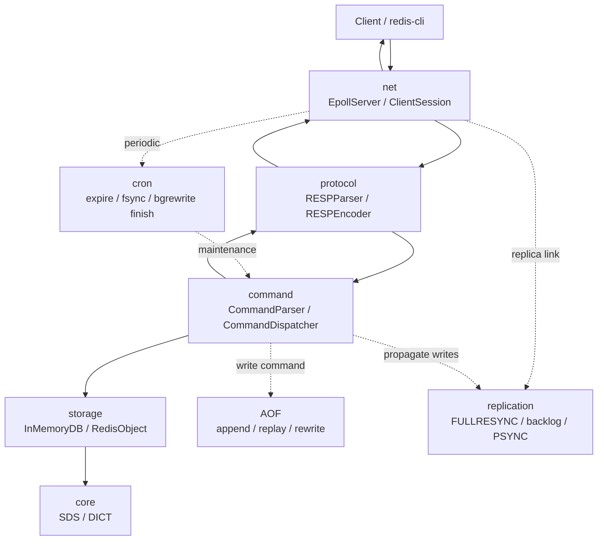

# TinyRedis

[English README](README.md)

TinyRedis 是一个基于 C++17 实现的 Redis 兼容内存数据库内核项目。它的目标是在代码规模可控、便于阅读和测试的前提下，复现 Redis 的核心请求链路和关键工程能力。

当前版本已经打通单线程 `epoll` 事件循环、RESP2 编解码、命令解析与分发、String/Hash 数据类型、TTL 过期、AOF 持久化、`INFO` 运行指标，以及简化版 PSYNC 主从复制。

## 项目亮点

- 基于 Linux `epoll` 的单线程非阻塞网络服务。
- RESP2 解析器支持半包、粘包和 pipeline。
- Redis 风格命令分发，命令名大小写不敏感，错误回复尽量贴近 Redis。
- 支持 String、整数、Key、Hash、TTL、`INFO`、AOF rewrite 和复制相关命令。
- 实现 SDS 和 DICT，其中 DICT 支持 Redis 风格双表渐进式 rehash。
- 惰性过期和事件循环 cron 主动过期结合。
- AOF 支持写命令追加、启动 replay、同步 rewrite、后台 rewrite、rewrite buffer 合并，以及 `always/everysec/no` 刷盘策略。
- 简化版 master/replica 复制，支持 `PING -> REPLCONF -> PSYNC` 握手、命令流全量同步、写命令传播、replication backlog、partial resync 和断线重连恢复。
- 使用 GTest 覆盖底层结构、RESP、配置、命令、AOF 和 TCP E2E 流程。

## 开发环境

- Linux。当前网络层使用 `epoll`，服务端监听 `127.0.0.1`。
- C++17 编译器，例如 `g++` 或 `clang++`。
- CMake 3.10 或更新版本。
- 构建测试时需要 GTest。

Ubuntu/Debian 可以安装：

```bash
sudo apt update
sudo apt install -y build-essential cmake libgtest-dev
```

如果安装 `libgtest-dev` 后 CMake 仍然找不到 GTest，通常是发行版只安装了源码但没有提供 CMake 包。可以改用发行版的 `googletest` 包，或者先从源码安装 GTest 后再重新执行 CMake。

只编译服务端、不构建测试时可以跳过 GTest：

```bash
cmake -S . -B build -DBUILD_TESTING=OFF
cmake --build build -j
./build/tinyredis
```

## 快速开始

在项目根目录构建：

```bash
cmake -S . -B build
cmake --build build -j
```

启动 TinyRedis：

```bash
./build/tinyredis
```

默认监听 `127.0.0.1:6379`。内置默认配置会开启 AOF，使用 `appendonly.aof`，刷盘策略为 `appendfsync always`。

使用 `redis-cli` 连接：

```bash
redis-cli -p 6379
127.0.0.1:6379> PING
PONG
127.0.0.1:6379> SET hello world
OK
127.0.0.1:6379> GET hello
"world"
```

可以直接覆盖端口：

```bash
./build/tinyredis 6380
./build/tinyredis --port 6380
```

也可以指定配置文件：

```bash
./build/tinyredis --config conf/tinyredis.conf
./build/tinyredis --config conf/tinyredis.conf --port 6380
```

兼容的位置参数写法：

```bash
./build/tinyredis 6380
./build/tinyredis conf/tinyredis.conf
./build/tinyredis 6380 conf/tinyredis.conf
```

如果同时指定配置文件和命令行端口，命令行端口优先。

## 配置文件

配置样例：

```conf
port 6379
appendonly yes
appendfilename appendonly.aof
appendfsync everysec
# replicaof 127.0.0.1 6379
```

当前支持的配置项：

| 配置项 | 说明 |
| --- | --- |
| `port <1..65535>` | 监听端口。服务端绑定到 loopback。 |
| `appendonly yes/no` | 是否开启 AOF，也支持 `true/false` 和 `1/0`。 |
| `appendfilename <path>` | AOF 文件路径；相对路径按进程当前工作目录解析。 |
| `appendfsync always/everysec/no` | AOF 刷盘策略。 |
| `replicaof <host> <port>` | 以 replica 模式连接指定 master；host 当前必须是 IPv4 地址。 |
| `replicaof no one` | 配置解析时切回 master 角色。 |

配置文件中每个非空行是一条指令，`#` 后面是注释。未知指令或参数数量不正确会导致启动失败。

## 架构设计

TinyRedis 的主请求链路按层拆分：

```text
Client
  -> net:       EpollServer / ClientSession
  -> protocol:  RESPParser / RESPEncoder
  -> command:   CommandParser / CommandDispatcher
  -> storage:   InMemoryDB / RedisObject
  -> core:      SDS / DICT
```

旁路能力：

- AOF 负责写命令追加、启动重放、rewrite、后台 rewrite 和 fsync。
- 复制模块维护 master/replica 状态、全量同步 payload、backlog、partial resync 和写命令传播。
- `CommandDispatcher::cron()` 由事件循环周期调用，用于主动过期、AOF `everysec` 刷盘和后台 rewrite 收尾。



## 支持命令

基础命令：

- `PING [message]`

String 和 Key：

- `SET key value`
- `MSET key value [key value ...]`
- `GET key`
- `MGET key [key ...]`
- `DEL key [key ...]`
- `EXISTS key [key ...]`
- `INCR key`
- `INCRBY key increment`
- `DECR key`

Hash：

- `HSET key field value [field value ...]`
- `HGET key field`
- `HMGET key field [field ...]`
- `HDEL key field [field ...]`
- `HEXISTS key field`
- `HLEN key`
- `HKEYS key`
- `HVALS key`
- `HGETALL key`

TTL：

- `EXPIRE key seconds`
- `TTL key`
- `PTTL key`
- `PERSIST key`

观测和持久化：

- `INFO [server|clients|stats|persistence|replication|default|all]`
- `REWRITEAOF`
- `BGREWRITEAOF`

复制握手：

- `REPLCONF ...`
- `PSYNC ? -1`
- `PSYNC <replid> <offset>`

Replica 实例会拒绝普通写命令，并返回 `READONLY` 错误。来自 master 复制流的写命令会在内部回放。

## 主从复制

启动 master：

```bash
./build/tinyredis --port 6379
```

创建 replica 配置，例如 `conf/replica.conf`：

```conf
port 6380
appendonly yes
appendfilename replica.aof
appendfsync everysec
replicaof 127.0.0.1 6379
```

启动 replica：

```bash
./build/tinyredis --config conf/replica.conf
```

复制行为：

- Replica 连接 master 后依次发送 `PING`、`REPLCONF`、`PSYNC`。
- 首次同步使用 `PSYNC ? -1`，master 返回 `FULLRESYNC`。
- 全量同步不发送 RDB 文件，而是发送当前内存快照对应的 Redis 命令流。
- 全量同步完成后，master 会把后续写命令传播给已连接 replica。
- Replica 断线重连时，如果复制 id 匹配且 offset 仍在 backlog 中，master 返回 `CONTINUE` 并补发缺失命令。
- 如果无法部分重同步，则退回全量同步。

该实现有意保持简化，暂未实现 ACK 跟踪、`replid2`、Sentinel、Cluster、自动故障转移和基于 RDB 的全量同步。

## AOF 持久化

开启 AOF 后，成功执行的写命令会追加到配置的 AOF 文件。服务启动时会回放 AOF，恢复内存数据。

支持三种刷盘策略：

- `always`：每条写命令后执行 fsync。
- `everysec`：由事件循环 cron 路径约每秒刷盘。
- `no`：交给操作系统决定刷盘时机。

AOF rewrite 命令：

- `REWRITEAOF`：基于当前内存快照同步生成紧凑 AOF。
- `BGREWRITEAOF`：后台生成临时 AOF，主线程继续处理写命令；后台任务完成后，在 cron 中合并 rewrite buffer 并原子切换文件。

当前 rewrite 快照会生成 `SET`、`HSET` 和 `EXPIRE` 命令。TTL 在 rewrite 时会向上取整到秒。

## 运行测试

`BUILD_TESTING=ON` 时，CMake 会构建测试目标并注册到 CTest：

```bash
cmake -S . -B build
cmake --build build -j
ctest --test-dir build --output-on-failure
```

也可以单独运行：

```bash
./build/test_sds
./build/test_dict
./build/test_resp
./build/test_config
./build/test_command
./build/test_aof
./build/test_e2e
```

其中 `test_e2e` 会启动本机 TCP 服务进程，覆盖客户端命令流、异常连接、主从全量同步、partial resync 和重连恢复。

## 性能基线

`perf/` 目录保存 benchmark 配置和基于 `redis-benchmark` 的脚本。

构建并启动 no-AOF 基线：

```bash
cmake --build build -j
./build/tinyredis --config perf/noaof.conf
```

另开终端运行默认 benchmark：

```bash
bash perf/benchmark.sh
```

默认参数：

```text
HOST=127.0.0.1
PORT=6380
REQUESTS=100000
CLIENTS=50
TESTS=set,get,incr
```

第一版本地性能基线记录在 [perf/README.md](perf/README.md)。

## 目录结构

```text
TinyRedis/
├── CMakeLists.txt
├── main.cpp
├── include/        # 头文件：net/protocol/command/core/object/persistence/replication
├── src/            # 源码实现
├── test/           # 单元测试与 TCP E2E 测试
├── docs/           # 设计文档与资源
├── conf/           # 配置样例
└── perf/           # benchmark 配置与脚本
```

## 当前限制

TinyRedis 保留 Redis 的核心设计思想，但当前仍是一个教学/项目级实现。

暂未实现：

- List、Set、ZSet 数据类型。
- 多逻辑数据库。
- 事务、Lua、发布订阅、Stream、Module、Sentinel、Cluster 和自动故障转移。
- RDB 持久化和 RDB+AOF 混合持久化。
- 基于 RDB 的全量同步。
- `SET` 的 `EX`、`PX`、`NX`、`XX`、`KEEPTTL` 等选项。
- 完整 Redis 复制语义，例如 ACK 跟踪和 `replid2`。

更完整的实现说明见 [docs/design.md](docs/design.md)。

## 相关文章

- [从0到1做一个 C++ Redis内核：项目设计与模块拆分](https://blog.csdn.net/2402_87224981/article/details/160474316)
- [基于epoll的单线程Reactor：Tinyredis的网络层实现](https://blog.csdn.net/2402_87224981/article/details/160557193)
