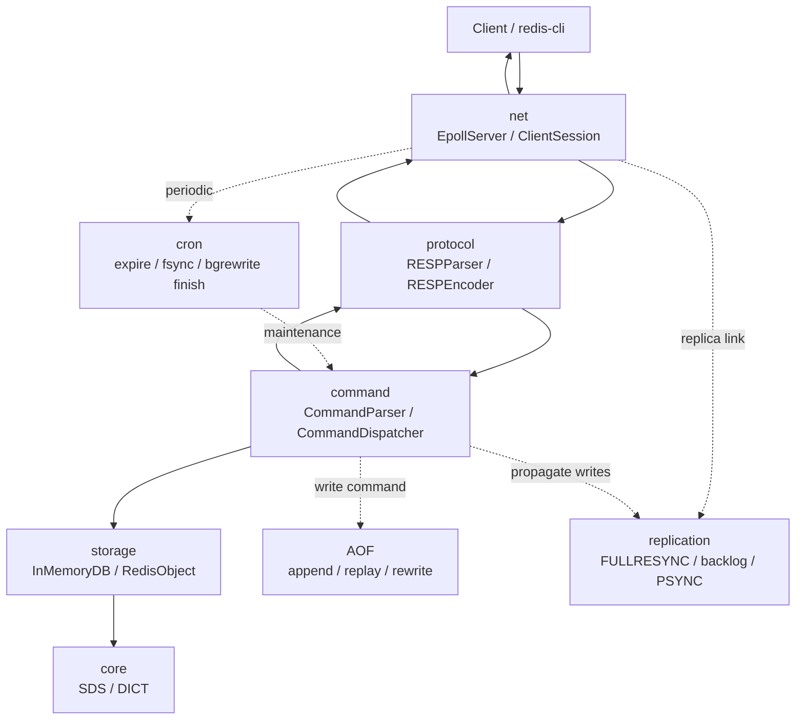

# TinyRedis
## 项目简介
TinyRedis 是一个基于 C++17 实现的 Redis 兼容内存数据库内核项目，目标是在贴近真实工程的前提下逐步复现 Redis 的核心能力。  
当前版本已打通 `epoll` 单线程事件循环、RESP2 编解码、命令解析与分发链路，并支持 String、基础 Hash、TTL、AOF 持久化与简化版 PSYNC 主从复制。  
项目重点关注模块化设计、底层数据结构、持久化、复制和可测试性。


## 开发环境
- Linux（当前网络层基于 `epoll`，不支持 Windows/macOS 原生网络层）
- C++17 编译器（`g++`/`clang++`）
- CMake >= 3.10
- GTest（默认开启测试构建；如果只编译服务端，可以通过 `-DBUILD_TESTING=OFF` 跳过）

Ubuntu/Debian 可以先安装依赖：

```bash
sudo apt update
sudo apt install -y build-essential cmake libgtest-dev
```

如果你的发行版安装 `libgtest-dev` 后仍然提示找不到 GTest，通常是系统包没有提供 CMake 配置文件。可以改用发行版提供的 `googletest` 包，或者先从源码安装 GTest 后再重新执行 CMake。

只想编译并运行 TinyRedis 服务端、不运行测试时，可以不安装 GTest：

```bash
cmake -S . -B build -DBUILD_TESTING=OFF
cmake --build build -j
./build/tinyredis
```

## 架构设计

TinyRedis 当前采用单线程 `epoll` 事件循环模型，主请求链路按 `net -> protocol -> command -> storage -> core` 分层。AOF 不在普通读请求主链路上，只在启动恢复和写命令持久化时参与。


- 请求链路：`Client -> EpollServer -> RESPParser -> CommandParser -> CommandDispatcher -> InMemoryDB`
- 响应链路：`CommandDispatcher -> RESPEncoder -> ClientSession::writeBuf -> handleClientWrite -> Client`
- 持久化旁路：AOF 负责写命令追加、启动恢复、同步/后台重写与可配置 fsync 策略
- cron 任务：当前不是独立线程，而是在 `EpollServer::run` 事件循环中周期触发 `CommandDispatcher::cron`

### 架构图



## 核心能力
- 已实现命令：`PING/SET/MSET/GET/MGET/DEL/EXISTS/INCR/INCRBY/DECR/HSET/HGET/HDEL/HEXISTS/HLEN/EXPIRE/TTL/PTTL/PERSIST/INFO/REWRITEAOF/BGREWRITEAOF`
- 底层结构：实现 SDS 和 DICT，其中 DICT 支持双哈希表渐进式 rehash，读写删除操作会顺带推进迁移，降低单次扩容抖动
- 过期策略：惰性过期（访问时检查）+ 主动过期（事件循环周期触发抽样清理）
- 配置：支持配置文件和启动参数设置端口、AOF 开关、AOF 文件路径、`appendfsync` 策略和 `replicaof` 复制角色
- 观测：支持 `INFO` 输出 server、clients、stats、persistence、replication 基础指标
- 复制：支持简化版 master/replica，全量快照命令流同步、后续写命令传播、replication backlog、partial resync 和断线重连
- 持久化：AOF（写命令追加 + 启动重放恢复 + `REWRITEAOF/BGREWRITEAOF` + `always/everysec/no` fsync 策略）
- 测试基线：`test_sds`、`test_dict`、`test_resp`、`test_config`、`test_command`、`test_aof`、`test_e2e`（已接入 CTest）

## 项目亮点
- 网络与协议：基于 `epoll` LT 实现单线程事件循环，RESP2 解析器支持半包、粘包和 pipeline，一次读事件可连续解析多条完整命令。
- 存储与对象：实现 SDS、DICT、RedisObject 和 InMemoryDB；DICT 使用 Redis 风格双表渐进式 rehash，Hash 类型复用该底层结构。
- 持久化：AOF 覆盖写命令追加、启动 replay、同步 rewrite、后台 `BGREWRITEAOF`、rewrite buffer 和 `appendfsync` 策略。
- 主从复制：实现 `PING -> REPLCONF -> PSYNC` 握手、`FULLRESYNC` 命令流全量同步、写命令传播、backlog、partial resync 和 replica 断线重连。
- 工程验证：使用 GTest 覆盖基础结构、协议、配置、命令、AOF 和 TCP E2E；复制 E2E 覆盖全量同步、增量传播、backlog 补发和重连恢复。


## 与 Redis 官方实现的主要差异

TinyRedis 保留 Redis 的核心设计思想，但当前仍是教学/简历项目级实现：网络层直接使用单线程 `epoll`；全量复制使用命令流而不是 RDB；持久化暂未实现 RDB 和混合持久化；复制暂未实现 ACK、replid2、Sentinel、Cluster 和自动故障转移。更完整对比见 [docs/design.md](docs/design.md)。


## 目录结构
```text
TinyRedis/
├── CMakeLists.txt
├── main.cpp
├── include/        # 头文件：net/protocol/command/core/object/persistence/replication
├── src/            # 源码实现
├── test/           # 单元测试与 TCP E2E 测试
├── docs/           # 设计文档与路线图
├── conf/           # 配置样例
└── perf/           # 性能基线
```

## 快速开始
拉取代码后，在项目根目录执行：

```bash
cmake -S . -B build
cmake --build build -j
./build/tinyredis
```

默认监听 `127.0.0.1:6379`，也可以通过第一个参数指定端口：

```bash
./build/tinyredis 6380
```

也可以显式指定配置文件。TinyRedis 默认不会自动读取 `conf/tinyredis.conf`，只有传入 `--config` 或把配置文件路径作为位置参数时才会加载：

```bash
./build/tinyredis --config conf/tinyredis.conf
./build/tinyredis --config conf/tinyredis.conf --port 6380
```

兼容的位置参数写法：

```bash
./build/tinyredis 6380
./build/tinyredis conf/tinyredis.conf
./build/tinyredis 6380 conf/tinyredis.conf
```

如果同时指定配置文件和端口参数，命令行端口会覆盖配置文件里的 `port`。

### 配置文件说明

当前支持的配置项：

```conf
port 6379
appendonly yes
appendfilename appendonly.aof
appendfsync everysec
# replicaof 127.0.0.1 6379
```

- `port`：监听端口，范围 `1..65535`，默认 `6379`
- `appendonly`：是否开启 AOF，支持 `yes/no`、`true/false`、`1/0`
- `appendfilename`：AOF 文件路径；相对路径会按启动进程时的当前工作目录解析
- `appendfsync`：AOF 刷盘策略，支持 `always/everysec/no`
- `replicaof <host> <port>`：以 replica 模式连接 master；也支持 `replicaof no one` 切回 master 配置

配置文件语法是每行一个指令，`#` 后面是注释。未知指令或参数数量不正确会导致启动失败。

## 运行测试
测试依赖 GTest。默认 `BUILD_TESTING=ON` 时会编译测试目标，然后执行：

```bash
ctest --test-dir build --output-on-failure
```

也可以单独运行核心测试：

```bash
./build/test_dict
./build/test_command
./build/test_aof
./build/test_e2e
```

其中 `test_e2e` 会启动本机 TCP 服务进程，覆盖客户端命令流、异常连接、主从全量同步、partial resync 和重连同步。


## 文档索引
- [设计说明](docs/design.md)
- [性能基线](perf/README.md)

## 性能摘要
当前已记录第一版性能基线，包括 AOF 策略对比和 no AOF 不同客户端数的并发基线。

详见：[perf/README.md](perf/README.md)

## 相关文章
[从0到1做一个 C++ Redis内核：项目设计与模块拆分](https://blog.csdn.net/2402_87224981/article/details/160474316)  
[基于epoll的单线程Reactor：Tinyredis的网络层实现](https://blog.csdn.net/2402_87224981/article/details/160557193)
