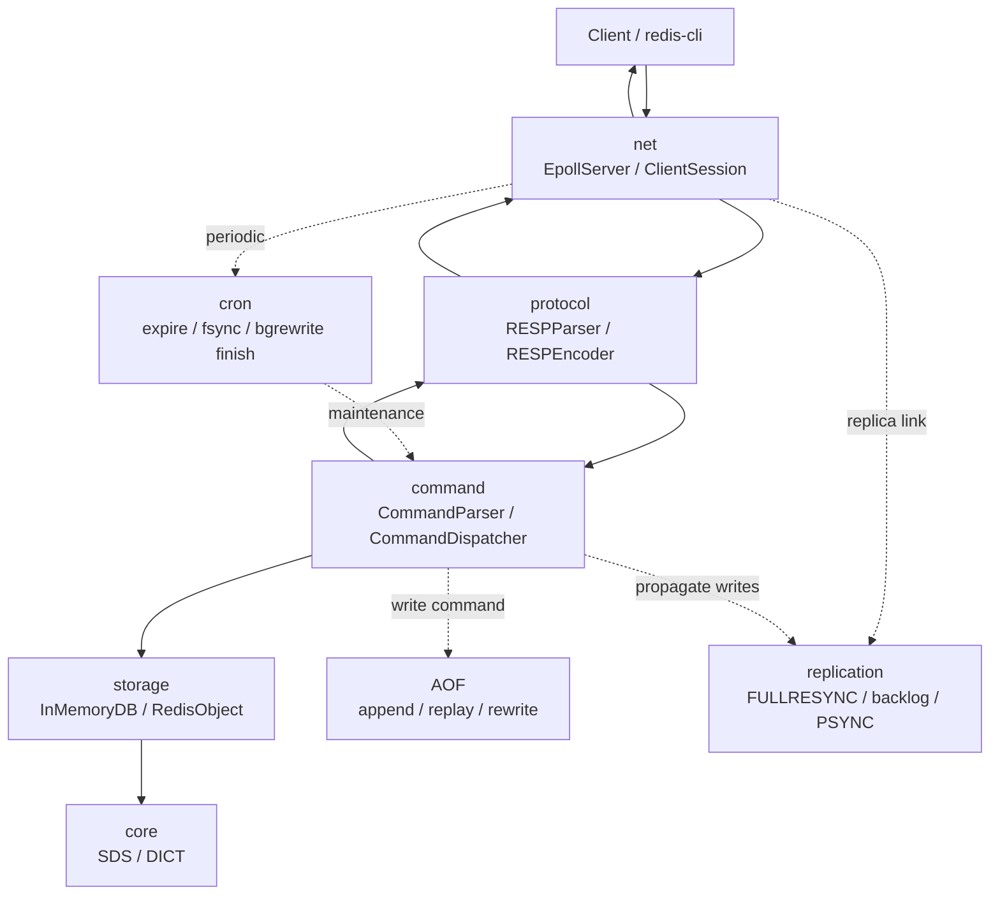

# TinyRedis

[中文文档](README-CN.md)

TinyRedis is a Redis-compatible in-memory database kernel implemented in C++17. It is built as a compact systems project that reproduces the core Redis request path while keeping the implementation small enough to study, test, and extend.

The current version includes a single-threaded `epoll` event loop, RESP2 parsing and encoding, command parsing and dispatch, String and Hash data types, TTL expiration, AOF persistence, runtime `INFO` metrics, and a simplified PSYNC-based master/replica replication flow.

## Highlights

- Single-threaded Linux `epoll` server with non-blocking sockets.
- RESP2 parser that handles partial packets, sticky packets, and pipelined requests.
- Redis-style command dispatcher with case-insensitive command names and Redis-like error replies.
- String, integer, key, Hash, TTL, `INFO`, AOF rewrite, and replication commands.
- SDS and DICT implementations, including Redis-style incremental rehash for DICT.
- Lazy expiration on access plus active expiration from the server cron path.
- AOF append, startup replay, synchronous rewrite, background rewrite, rewrite buffer merge, and `always/everysec/no` fsync policies.
- Simplified master/replica replication with `PING -> REPLCONF -> PSYNC`, full command-stream resync, backlog-based partial resync, write propagation, and reconnect recovery.
- GTest coverage for core data structures, RESP, config, command behavior, AOF, and TCP E2E flows.

## Requirements

- Linux. The network layer currently uses `epoll` and binds to `127.0.0.1`.
- C++17 compiler such as `g++` or `clang++`.
- CMake 3.10 or newer.
- GTest when building tests.

On Ubuntu/Debian:

```bash
sudo apt update
sudo apt install -y build-essential cmake libgtest-dev
```

If your distribution installs GTest sources but does not provide a CMake package, install the distribution `googletest` package or build and install GTest from source before running CMake with tests enabled.

To build only the server without GTest:

```bash
cmake -S . -B build -DBUILD_TESTING=OFF
cmake --build build -j
./build/tinyredis
```

## Quick Start

Build from the project root:

```bash
cmake -S . -B build
cmake --build build -j
```

Start TinyRedis:

```bash
./build/tinyredis
```

By default the server listens on `127.0.0.1:6379`. The built-in default configuration enables AOF with `appendonly.aof` and `appendfsync always`.

Connect with `redis-cli`:

```bash
redis-cli -p 6379
127.0.0.1:6379> PING
PONG
127.0.0.1:6379> SET hello world
OK
127.0.0.1:6379> GET hello
"world"
```

You can override the port directly:

```bash
./build/tinyredis 6380
./build/tinyredis --port 6380
```

Or start from a config file:

```bash
./build/tinyredis --config conf/tinyredis.conf
./build/tinyredis --config conf/tinyredis.conf --port 6380
```

Compatible positional forms are also supported:

```bash
./build/tinyredis 6380
./build/tinyredis conf/tinyredis.conf
./build/tinyredis 6380 conf/tinyredis.conf
```

When both a config file and a command-line port are provided, the command-line port wins.

## Configuration

Sample config:

```conf
port 6379
appendonly yes
appendfilename appendonly.aof
appendfsync everysec
# replicaof 127.0.0.1 6379
```

Supported directives:

| Directive | Description |
| --- | --- |
| `port <1..65535>` | Listening port. The server binds to loopback. |
| `appendonly yes/no` | Enable or disable AOF. Also accepts `true/false` and `1/0`. |
| `appendfilename <path>` | AOF path. Relative paths are resolved from the process working directory. |
| `appendfsync always/everysec/no` | AOF fsync policy. |
| `replicaof <host> <port>` | Start as a replica of the given master. The host must be an IPv4 address. |
| `replicaof no one` | Switch back to master role in config parsing. |

Each non-empty line is one directive. `#` starts a comment. Unknown directives or invalid argument counts fail startup.

## Architecture

TinyRedis follows a layered request path:

```text
Client
  -> net:       EpollServer / ClientSession
  -> protocol:  RESPParser / RESPEncoder
  -> command:   CommandParser / CommandDispatcher
  -> storage:   InMemoryDB / RedisObject
  -> core:      SDS / DICT
```

Side paths:

- AOF handles write command append, startup replay, rewrite, background rewrite, and fsync.
- Replication tracks master/replica state, full resync payloads, backlog, partial resync, and write propagation.
- `CommandDispatcher::cron()` is called periodically from the event loop for active expiration, AOF `everysec` flushing, and background rewrite completion.



## Supported Commands

Basic:

- `PING [message]`

String and key:

- `SET key value`
- `MSET key value [key value ...]`
- `GET key`
- `MGET key [key ...]`
- `DEL key [key ...]`
- `EXISTS key [key ...]`
- `INCR key`
- `INCRBY key increment`
- `DECR key`

Hash:

- `HSET key field value [field value ...]`
- `HGET key field`
- `HMGET key field [field ...]`
- `HDEL key field [field ...]`
- `HEXISTS key field`
- `HLEN key`
- `HKEYS key`
- `HVALS key`
- `HGETALL key`

TTL:

- `EXPIRE key seconds`
- `TTL key`
- `PTTL key`
- `PERSIST key`

Observability and persistence:

- `INFO [server|clients|stats|persistence|replication|default|all]`
- `REWRITEAOF`
- `BGREWRITEAOF`

Replication handshake:

- `REPLCONF ...`
- `PSYNC ? -1`
- `PSYNC <replid> <offset>`

Replica instances reject normal write commands with a `READONLY` error. Writes applied from the master replication stream are replayed internally.

## Replication

Start a master:

```bash
./build/tinyredis --port 6379
```

Create a replica config, for example `conf/replica.conf`:

```conf
port 6380
appendonly yes
appendfilename replica.aof
appendfsync everysec
replicaof 127.0.0.1 6379
```

Start the replica:

```bash
./build/tinyredis --config conf/replica.conf
```

Replication behavior:

- The replica connects to the master and sends `PING`, `REPLCONF`, then `PSYNC`.
- First sync uses `PSYNC ? -1` and receives `FULLRESYNC`.
- Full sync is represented as a stream of Redis commands instead of an RDB file.
- After full sync, the master propagates write commands to connected replicas.
- If a replica reconnects with a known replication id and offset that are still in the backlog, the master returns `CONTINUE` and sends the missing backlog commands.
- If partial resync is not possible, the master falls back to full resync.

This is intentionally simpler than Redis. It does not implement ACK tracking, `replid2`, Sentinel, Cluster, automatic failover, or RDB-based full synchronization.

## Persistence

When AOF is enabled, successful write commands are appended to the configured AOF file. On startup, TinyRedis replays the AOF to restore the in-memory dataset.

Supported fsync policies:

- `always`: fsync each write command.
- `everysec`: flush from the event-loop cron path roughly once per second.
- `no`: leave flushing to the operating system.

AOF rewrite commands:

- `REWRITEAOF` builds a compact AOF synchronously from the current memory snapshot.
- `BGREWRITEAOF` builds a temporary AOF in the background, buffers concurrent writes, and atomically switches files from the cron path after the background rewrite finishes.

Snapshot rewrite currently emits `SET`, `HSET`, and `EXPIRE` commands. TTL values are rounded up to seconds during rewrite.

## Tests

With `BUILD_TESTING=ON`, CMake builds the test targets and registers them with CTest:

```bash
cmake -S . -B build
cmake --build build -j
ctest --test-dir build --output-on-failure
```

Individual targets:

```bash
./build/test_sds
./build/test_dict
./build/test_resp
./build/test_config
./build/test_command
./build/test_aof
./build/test_e2e
```

`test_e2e` starts local TCP server processes and covers client command streams, invalid connections, full replication sync, partial resync, and reconnect recovery.

## Performance

The `perf/` directory contains benchmark configs and a wrapper around `redis-benchmark`.

Build and start a no-AOF baseline:

```bash
cmake --build build -j
./build/tinyredis --config perf/noaof.conf
```

Run the default benchmark from another terminal:

```bash
bash perf/benchmark.sh
```

Default benchmark parameters:

```text
HOST=127.0.0.1
PORT=6380
REQUESTS=100000
CLIENTS=50
TESTS=set,get,incr
```

The first recorded local baseline is documented in [perf/README.md](perf/README.md).

## Project Layout

```text
TinyRedis/
├── CMakeLists.txt
├── main.cpp
├── include/        # Headers: net/protocol/command/core/object/persistence/replication
├── src/            # Implementations
├── test/           # Unit tests and TCP E2E tests
├── docs/           # Design notes and assets
├── conf/           # Sample configuration
└── perf/           # Benchmark configs and scripts
```

## Current Limitations

TinyRedis keeps the core Redis ideas but is still a compact educational/project implementation.

Not implemented yet:

- List, Set, and ZSet data types.
- Multiple logical databases.
- Transactions, Lua scripting, pub/sub, streams, modules, Sentinel, Cluster, and automatic failover.
- RDB persistence and mixed RDB+AOF persistence.
- RDB-based full sync.
- `SET` options such as `EX`, `PX`, `NX`, `XX`, and `KEEPTTL`.
- Complete Redis replication semantics such as ACK tracking and `replid2`.

See [docs/design.md](docs/design.md) for deeper implementation notes.

## Related Articles

- [从0到1做一个 C++ Redis内核：项目设计与模块拆分](https://blog.csdn.net/2402_87224981/article/details/160474316)
- [基于epoll的单线程Reactor：Tinyredis的网络层实现](https://blog.csdn.net/2402_87224981/article/details/160557193)
